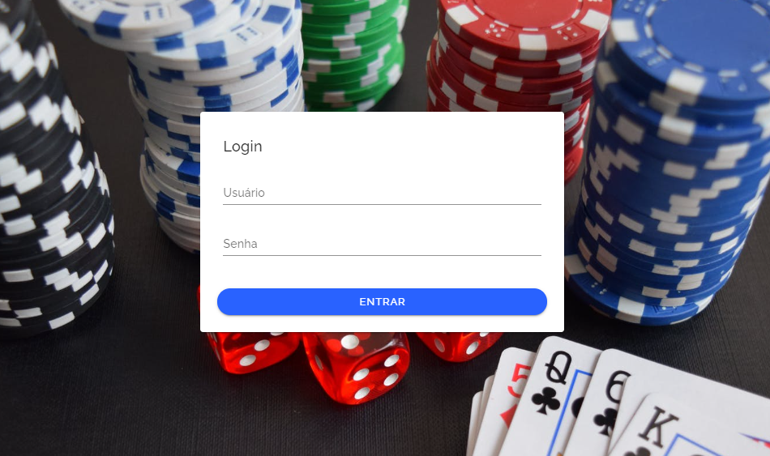

# Clubepoker

- Sistema desenvolvido para usário administrador, realizar o controle de entrega de fichas para jogadores de poker.


## Executar este comando em sua máquina
```
npm install
```

### Depois rodar em sua máquina o comando
```
npm run serve
```

### Para subir em produção, antes execute este comando
```
npm run build
```

